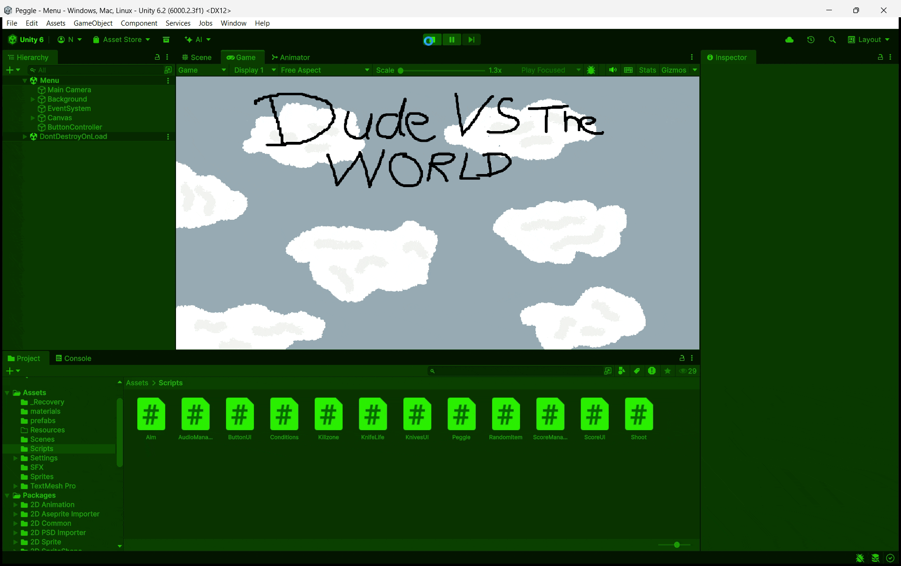

# m2gdv

# Praktijk Opdracht 1A

Ik heb een random item generator gemaakt met arrays. Ik heb stands van JoJo's Bizarre Adventure gekozen als mijn tien random items.
[Script 1](https://github.com/naokimon/m2gdv/blob/main/Scripts/RandomItems.cs)

# Opdracht 2.1: Forces & Collisions

Hier zie je het begin van mijn game. Hier zie ipv een ball mijn al gekozen Voorwerp die ik ga gebruiken in mijn game. 
[Script 1](https://github.com/naokimon/m2gdv/blob/main/Assets/Scripts/Shoot.cs)
[Script 2](https://github.com/naokimon/m2gdv/blob/main/Assets/Scripts/Aim.cs)

# Opdracht 2.2: Mikken, Schieten en Line Renderer

Ik gebruik hier dezelfde gif als de vorige opdrachten omdat je hier precies ziet wat er ook bij dit opdracht hoort. Mijn line renderer is rood, ik kan mikken en schieten.

[Script 1](https://github.com/naokimon/m2gdv/blob/main/Assets/Scripts/Shoot.cs)
[Script 2](https://github.com/naokimon/m2gdv/blob/main/Assets/Scripts/Aim.cs)

# Opdracht 3.1 Score & Triggers

Hier zie je mijn volledige game ik heb sinds opdracht 2.2 geen logs bij gehouden dus hier zie je op deze gif de volledig game. Je ziet de score omhoog gaan per geel mannetje die je raakt met je mes.

[Script 1](https://github.com/naokimon/m2gdv/blob/main/Assets/Scripts/ScoreManager.cs)

# Opdracht 3.2 Bumpers en Combo System

Mijn combo systeem is gemaakt en het werkt.

[Script 1](https://github.com/naokimon/m2gdv/blob/main/Assets/Scripts/ScoreManager.cs)

# Opdracht 4.1 Leveldesign & UI

In het begin zie je de custom font die ik heb toegevoegd en de 9sliced buttons.

# Opdracht 4.2 Scores Versturen

Op de gif zie je dat de scores verstuurd worden naar de UI.

[Script 1](https://github.com/naokimon/m2gdv/blob/main/Assets/Scripts/ScoreUI.cs)

# Opdracht 5.2 Particles, sounds &  shakes

Op de gif hoor je geen geluid maar er zit achtergrond muziek voor elke scene op de main menu, game, win en loss screen. Ik heb geen particles want dat vond ik niet nodig maar ik heb wel de sprite laten veranderen op hit.

[Script 1](https://github.com/naokimon/m2gdv/blob/main/Assets/Scripts/AudioManager.cs)
[Script 2](https://github.com/naokimon/m2gdv/blob/main/Assets/Scripts/Peggle.cs)

# Opdracht 6.1 Afronden en uitbreiden

Mijn game is gefinetuned, alle features werken en de laaatste build werkt ook.

[Build](https://github.com/naokimon/m2gdv/tree/main/Game)

