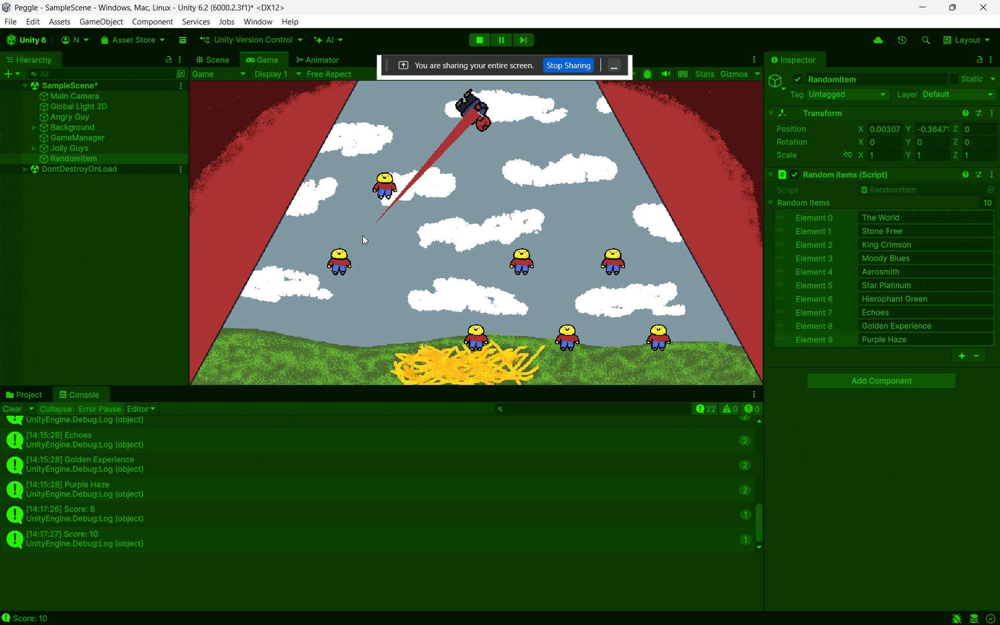

# m2gdv

# Praktijk Opdracht 1A

Ik heb een random item generator gemaakt met arrays. Ik heb stands van JoJo's Bizarre Adventure gekozen als mijn tien random items.
[Script 1](https://github.com/naokimon/m2gdv/blob/main/Scripts/RandomItems.cs)

# Opdracht 2.1: Forces & Collisions

Hier zie je het begin van mijn game. Hier zie ipv een ball mijn al gekozen Voorwerp die ik ga gebruiken in mijn game. 
[Script 1](https://github.com/naokimon/m2gdv/blob/main/Assets/Scripts/Shoot.cs)
[Script 2](https://github.com/naokimon/m2gdv/blob/main/Assets/Scripts/Aim.cs)

